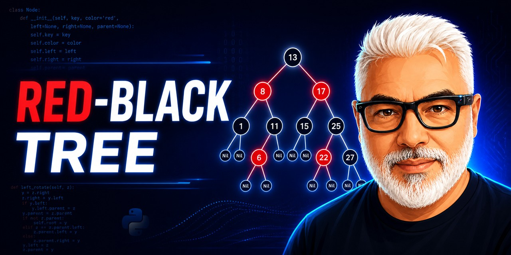

# Red-Black Tree — Programming Assignment 1



A Python implementation of the CLRS red-black tree with Tkinter visualization and interactive operations.

[Português](#português)

## Highlights

- Insertion, lookup, and deletion with red-black balancing
- Sentinel NIL nodes following the CLRS approach
- ASCII and canvas visualizations
- Desktop interface using only Python's standard library

## Getting started

```powershell
python ArvoreRubroNegra.py
```

Review the repository files before running commands that access external services or download models and datasets. Never commit credentials or personal data.

## Project status

This is an educational or experimental project. See [ROADMAP.md](ROADMAP.md) for intentionally scoped future work and [CONTRIBUTING.md](CONTRIBUTING.md) before proposing changes.

## License

Original source code is available under the [MIT License](LICENSE). Third-party datasets, models, media, services, course materials, and dependencies keep their own terms; see [THIRD_PARTY_NOTICE.md](THIRD_PARTY_NOTICE.md).

---

## Português

Implementação acadêmica de árvore rubro-negra baseada no CLRS, com inserção, busca, remoção e visualizações ASCII e Tkinter. Requer Python 3.12; não há dependências externas.

### Como começar

```powershell
python ArvoreRubroNegra.py
```

Consulte o [ROADMAP.md](ROADMAP.md) para funcionalidades futuras e o [CONTRIBUTING.md](CONTRIBUTING.md) antes de contribuir. Nunca envie credenciais ou dados pessoais ao repositório.

### Licença

O código-fonte original é disponibilizado sob a [Licença MIT](LICENSE). Datasets, modelos, mídias, serviços, materiais acadêmicos e dependências de terceiros preservam seus próprios termos; consulte [THIRD_PARTY_NOTICE.md](THIRD_PARTY_NOTICE.md).
